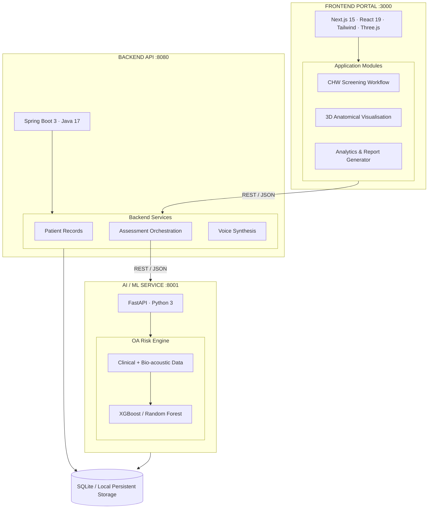
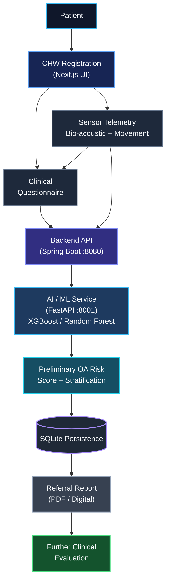

# OsteoSense

### AI-assisted, sensor-enabled osteoarthritis screening and risk stratification

 

**Accessible frontline musculoskeletal healthcare for community health workers**

 

---

## Table of Contents

- [Overview](#overview)
- [System Architecture](#system-architecture)
- [Technology Stack](#technology-stack)
- [Repository Structure](#repository-structure)
- [Data Flow](#data-flow)
- [Getting Started](#getting-started)
- [Configuration](#configuration)
- [Current Prototype vs Planned Development](#current-prototype-vs-planned-development)
- [Safety and Clinical Scope](#safety-and-clinical-scope)
- [Roadmap](#roadmap)
- [Documentation](#documentation)
- [License](#license)

---

## Overview

OsteoSense is a medical pilot platform for community-level osteoarthritis (OA) screening. It combines a structured clinical questionnaire, bio-acoustic and movement sensor telemetry, and machine-learning risk stratification into a single offline-capable workflow designed for community health workers (CHWs) operating at the frontline.

The system is intended for **preliminary screening and referral support** — not as a replacement for clinical diagnosis.

### Core Capabilities

| Capability | Description |
|------------|-------------|
| **CHW Screening Workflow** | Guided multi-step assessment from patient registration through risk stratification |
| **3D Anatomical Visualisation** | Interactive biomechanics and cine-loop showcases built with Three.js |
| **Risk Analytics** | Population-level and per-patient risk dashboards |
| **Automated Referral Reports** | Standardised, clinician-ready PDF output |
| **Multi-lingual Voice Synthesis** | Accessible output for low-literacy and regional-language settings |
| **Bio-acoustic + Sensor Telemetry** | Signal ingestion feeding the ML risk engine |

---

## System Architecture

OsteoSense is composed of three independently deployable services.

### Service Responsibilities

| Service | Stack | Port | Role |
|---------|-------|------|------|
| **Frontend Portal** | Next.js 15, React 19, Tailwind, Three.js | `3000` | CHW workflow, 3D visualisation, analytics, reporting |
| **Backend API** | Spring Boot 3, Java 17 | `8080` | Patient records, assessment orchestration, risk scores, voice synthesis |
| **AI / ML Service** | FastAPI, Python 3 | `8001` | OA risk engine (XGBoost / Random Forest) |

---

## Technology Stack

| Layer | Technology |
|-------|------------|
| **Frontend Framework** | Next.js 15 (App Router), React 19 |
| **Styling** | Tailwind CSS |
| **3D / Visualisation** | Three.js, React Three Fiber |
| **Backend Framework** | Spring Boot 3 |
| **Backend Language** | Java 17 |
| **AI Service** | FastAPI, Python 3 |
| **ML Models** | XGBoost, Random Forest |
| **Database** | SQLite (local persistent storage) |
| **Sensor Telemetry** | Bio-acoustic sensors, movement sensors |
| **Voice Synthesis** | Multi-lingual TTS (backend-integrated) |

---

## Repository Structure
<h2>Project Structure</h2>

<pre>
osteosense/
│
├── README.md
├── Contract.md
├── AGENTS.md / CLAUDE.md
│
├── app/
│   ├── layout.tsx
│   ├── globals.css
│   │
│   ├── (auth)/
│   │   └── login/
│   │       └── page.tsx
│   │
│   └── (dashboard)/
│       ├── layout.tsx
│       ├── dashboard/
│       │   └── page.tsx
│       │
│       ├── patients/
│       │   ├── page.tsx
│       │   └── [patientId]/
│       │       └── page.tsx
│       │
│       ├── assessments/
│       │   ├── page.tsx
│       │   ├── new/
│       │   │   └── page.tsx
│       │   └── [id]/
│       │       ├── page.tsx
│       │       └── report/
│       │           └── page.tsx
│       │
│       ├── analytics/
│       │   └── page.tsx
│       ├── reports/
│       │   └── page.tsx
│       └── settings/
│           └── page.tsx
│
├── components/
│   ├── 3d/
│   ├── canvas/
│   ├── assessment/
│   ├── dashboard/
│   ├── layout/
│   ├── providers/
│   ├── report/
│   └── ui/
│
├── hooks/
│   ├── use-patients.ts
│   ├── use-assessments.ts
│   └── use-connectivity.ts
│
├── lib/
│   ├── utils.ts
│   ├── api/
│   │   ├── client.ts
│   │   └── assessments.ts
│   └── i18n/
│       └── translations.ts
│
├── types/
│   └── index.ts
│
├── src/
│   └── main/
│       ├── java/
│       │   └── com/sih/module2/
│       │       ├── Module2Application.java
│       │       ├── controller/
│       │       │   └── AssessmentController.java
│       │       ├── service/
│       │       │   ├── AssessmentService.java
│       │       │   └── Module1Client.java
│       │       ├── repository/
│       │       │   └── AssessmentRepository.java
│       │       └── model/
│       │           ├── Assessment.java
│       │           └── AIRiskResponse.java
│       │
│       └── resources/
│           └── application.properties
│
├── app.py
├── feature_extractor.py
├── oa_risk_engine.py
├── database.py
├── outcome_entry.py
├── report.py
├── run_batch.py
├── synthetic_dataset.py
│
├── test_database.py
├── test_database_full.py
├── test_risk.py
│
├── module5/
│   ├── upload_data.py
│   └── dummy_patients.csv
│
├── docs/
│   └── FRONTEND_BACKEND_MAP.md
│
├── package.json
├── tsconfig.json
├── next.config.ts
├── postcss.config.mjs
├── eslint.config.mjs
└── pom.xml
</pre>

---

## Data Flow

<h2>Getting Started</h2>

  Follow the steps below to run the OsteoSense frontend, backend API,
  and AI/ML service locally.

<h3>Prerequisites</h3>

Make sure the following are installed:

<ul>
  <li><strong>Node.js</strong> 18+ and npm</li>
  <li><strong>Java</strong> 17+ and Maven</li>
  <li><strong>Python</strong> 3.10+</li>
</ul>

<h3>1. Frontend Development Server</h3>

Install the frontend dependencies:

<pre><code>npm install</code></pre>

Start the Next.js development server:

<pre><code>npm run dev</code></pre>

  The frontend will be available at:
  <a href="http://localhost:3000">
    <code>http://localhost:3000</code>
  </a>

<h3>2. Spring Boot Backend Server</h3>

Start the backend using Maven:

<pre><code>mvn spring-boot:run</code></pre>

  The backend API will be available at:
  <a href="http://localhost:8080">
    <code>http://localhost:8080</code>
  </a>

<h3>3. Python AI Engine</h3>

Start the FastAPI AI/ML service:

<pre><code>python app.py</code></pre>

  The AI service will be available at:
  <a href="http://localhost:8001">
    <code>http://localhost:8001</code>
  </a>

<blockquote>
  <strong>Important:</strong>
  The AI service on port <code>8001</code> must be running before the
  backend processes assessment requests that require OA risk
  stratification.
</blockquote>

<h2>Configuration</h2>

  OsteoSense uses separate configuration points for the frontend,
  Spring Boot backend, and AI/ML service.

<table>
  <thead>
    <tr>
      <th>File</th>
      <th>Purpose</th>
    </tr>
  </thead>

  <tbody>
    <tr>
      <td>
        <code>src/main/resources/application.properties</code>
      </td>
      <td>Spring Boot backend configuration</td>
    </tr>

    <tr>
      <td><code>lib/api/client.ts</code></td>
      <td>Frontend API client and backend base URL</td>
    </tr>

    <tr>
      <td><code>.env.local</code></td>
      <td>Frontend environment variables</td>
    </tr>

    <tr>
      <td><code>oa_risk_engine.py</code></td>
      <td>ML model loading and inference configuration</td>
    </tr>
  </tbody>
</table>

  Keep environment-specific credentials, API keys, and other secrets
  outside the source-controlled codebase.

<h2>Current Prototype</h2>

  The current prototype provides an end-to-end screening workflow
  covering patient registration, structured assessment, sensor
  telemetry ingestion, AI-assisted risk stratification, and referral
  support.

<h3>Implemented</h3>

<table>
  <thead>
    <tr>
      <th>Capability</th>
      <th>Description</th>
    </tr>
  </thead>

  <tbody>
    <tr>
      <td><strong>CHW Screening Workflow</strong></td>
      <td>
        Next.js clinician portal with a multi-step assessment workflow
      </td>
    </tr>

    <tr>
      <td><strong>3D Visualisation</strong></td>
      <td>
        Interactive anatomical biomechanics visualisation using Three.js
      </td>
    </tr>

    <tr>
      <td><strong>Backend API</strong></td>
      <td>
        Spring Boot REST API for patient and assessment operations
      </td>
    </tr>

    <tr>
      <td><strong>AI / ML Service</strong></td>
      <td>
        FastAPI service providing the OA risk engine
      </td>
    </tr>

    <tr>
      <td><strong>Risk Modelling</strong></td>
      <td>
        XGBoost and Random Forest based risk estimation
      </td>
    </tr>

    <tr>
      <td><strong>Persistence</strong></td>
      <td>
        SQLite-based local persistent storage
      </td>
    </tr>

    <tr>
      <td><strong>Referral Reports</strong></td>
      <td>
        Structured referral report generation
      </td>
    </tr>

    <tr>
      <td><strong>Voice Synthesis</strong></td>
      <td>
        Multi-lingual voice synthesis endpoint
      </td>
    </tr>

    <tr>
      <td><strong>Sensor Telemetry</strong></td>
      <td>
        Bio-acoustic and movement sensor telemetry ingestion
      </td>
    </tr>
  </tbody>
</table>

<h2>Planned Development</h2>

  The following capabilities are planned or currently in progress as
  OsteoSense evolves toward broader validation and deployment.

<table>
  <thead>
    <tr>
      <th>Planned Capability</th>
      <th>Purpose</th>
      <th>Status</th>
    </tr>
  </thead>

  <tbody>
    <tr>
      <td><strong>Bio-acoustic ML Integration</strong></td>
      <td>
        Integrate real bio-acoustic sensor features directly into the
        ML inference pipeline
      </td>
      <td>In Progress</td>
    </tr>

    <tr>
      <td><strong>Sensor Fusion</strong></td>
      <td>
        Combine clinical, acoustic, movement, and other sensor features
      </td>
      <td>Planned</td>
    </tr>

    <tr>
      <td><strong>Camera-based Movement Analysis</strong></td>
      <td>
        Expand movement-derived feature extraction
      </td>
      <td>Planned</td>
    </tr>

    <tr>
      <td><strong>Multi-lingual Coverage</strong></td>
      <td>
        Expand language support for frontline CHW deployments
      </td>
      <td>Planned</td>
    </tr>

    <tr>
      <td><strong>Offline Synchronisation</strong></td>
      <td>
        Support distributed deployments with intermittent connectivity
      </td>
      <td>Planned</td>
    </tr>

    <tr>
      <td><strong>Automated PDF Export</strong></td>
      <td>
        Generate downloadable and shareable referral reports
      </td>
      <td>Planned</td>
    </tr>

    <tr>
      <td><strong>Clinical Validation</strong></td>
      <td>
        Validate the ML model using appropriately labelled clinical data
      </td>
      <td>Planned</td>
    </tr>

    <tr>
      <td><strong>Field Testing</strong></td>
      <td>
        Evaluate usability and workflow performance with community
        health workers
      </td>
      <td>Planned</td>
    </tr>
  </tbody>
</table>

<h2>Safety and Clinical Scope</h2>

  

    <strong>
      OsteoSense is a screening and decision-support tool.
    </strong>
  

  OsteoSense is designed to support community health workers by
  providing structured assessment information and preliminary
  osteoarthritis risk stratification.

OsteoSense does <strong>not</strong>:

<ul>
  <li>Confirm an osteoarthritis diagnosis</li>
  <li>Replace a physician or qualified clinical assessment</li>
  <li>Replace radiological or other diagnostic examinations</li>
  <li>Prescribe treatment</li>
  <li>Independently determine a patient's clinical condition</li>
</ul>

  The system provides preliminary screening information intended to
  help identify individuals who may require further professional
  evaluation.

  <strong>
    Final diagnosis and clinical decisions remain the responsibility
    of qualified healthcare professionals.
  </strong>

<h2>Roadmap</h2>

<table>
  <thead>
    <tr>
      <th>Phase</th>
      <th>Deliverable</th>
      <th>Status</th>
    </tr>
  </thead>

  <tbody>
    <tr>
      <td>1</td>
      <td>CHW questionnaire and clinician UI</td>
      <td><strong>Complete</strong></td>
    </tr>

    <tr>
      <td>2</td>
      <td>3D anatomical visualisation</td>
      <td><strong>Complete</strong></td>
    </tr>

    <tr>
      <td>3</td>
      <td>Spring Boot backend and REST API</td>
      <td><strong>Complete</strong></td>
    </tr>

    <tr>
      <td>4</td>
      <td>FastAPI AI service and risk engine</td>
      <td><strong>Complete</strong></td>
    </tr>

    <tr>
      <td>5</td>
      <td>Sensor telemetry integration</td>
      <td><strong>In Progress</strong></td>
    </tr>

    <tr>
      <td>6</td>
      <td>ML model validation on labelled clinical data</td>
      <td><strong>Planned</strong></td>
    </tr>

    <tr>
      <td>7</td>
      <td>Field testing with community health workers</td>
      <td><strong>Planned</strong></td>
    </tr>

    <tr>
      <td>8</td>
      <td>Regulatory and compliance review</td>
      <td><strong>Planned</strong></td>
    </tr>
  </tbody>
</table>

<h2>Documentation</h2>

<table>
  <thead>
    <tr>
      <th>Document</th>
      <th>Description</th>
    </tr>
  </thead>

  <tbody>
    <tr>
      <td><code>Contract.md</code></td>
      <td>
        Inter-service interface and API contract
      </td>
    </tr>

    <tr>
      <td><code>docs/FRONTEND_BACKEND_MAP.md</code></td>
      <td>
        Frontend-to-backend endpoint mapping
      </td>
    </tr>

    <tr>
      <td><code>AGENTS.md</code> / <code>CLAUDE.md</code></td>
      <td>
        Internal development and assistant working notes
      </td>
    </tr>
  </tbody>
</table>

<h2>License</h2>

  OsteoSense is currently developed as a research and prototype
  platform.

  See <code>LICENSE</code> for licensing information.

  <h2>OsteoSense</h2>

  

    <strong>
      AI-assisted screening for accessible frontline
      musculoskeletal healthcare.
    </strong>
  

   

  

    Structured clinical assessment.
     
    Sensor-informed analysis.
     
    AI-assisted risk stratification.
     
    Actionable referral support.
  

   

  

    
      OsteoSense is a prototype and is not intended to replace
      professional medical diagnosis, clinical judgement, or
      treatment decisions.
    
  

